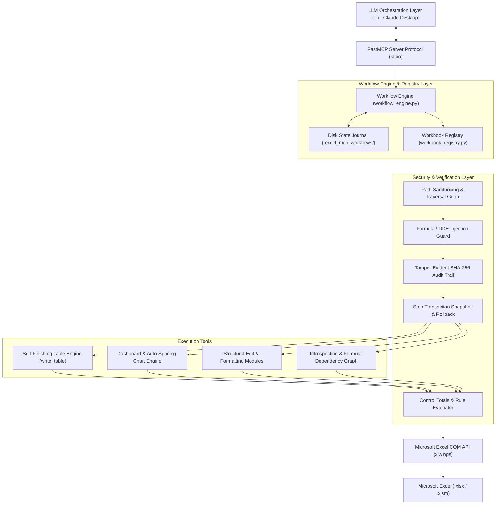

# Excel Automation MCP Server — Complete Capability & Architecture Overview

> **The Definitive Guide to the Enterprise-Grade, Deterministic AI Automation Server for Microsoft Excel**

---

## 📋 Executive Overview

The **Excel Automation MCP Server** is a comprehensive, production-hardened Model Context Protocol (MCP) server designed to enable Large Language Models (LLMs)—such as Claude Desktop—to control, automate, format, analyze, verify, and secure Microsoft Excel workbooks on Windows.

Unlike standard LLM spreadsheet scripts that are non-deterministic, error-prone, and visually unaligned, this project enforces **100% first-render perfection, mathematical verification, durable DAG workflow execution, multi-step transaction rollbacks, enterprise security sandboxing, and zero-dependency 1-click deployment**.

---

## 🔴 Problems Solved

| Problem | Standard AI Excel Automation | Excel MCP Server Solution |
|---|---|---|
| **Multi-Step Workflows** | PC crash or connection error loses all workflow progress mid-sequence. | `workflow_engine.py` persists step state to disk (`.excel_mcp_workflows/`) enabling workflow pausing and resuming from failed steps. |
| **Visual Quality** | Raw values written; dates show as raw numbers; column widths produce `####`. | `write_table` automatically formats numbers/dates/currencies, fits columns, clamps widths (8-48), wraps text, freezes headers, and builds native Excel Tables in 1 turn. |
| **Column Ordering** | Dict keys or DataFrames scramble column order arbitrarily. | Explicit `column_order` parameter strictly enforces left-to-right header layout with non-blocking AI proposals. |
| **Dashboard Layout** | Charts overlap data or each other; X-axis labels truncate; legends block bars. | `create_dashboard` & `create_chart` automatically position legends at the bottom, tilt X-labels at $-45^\circ$, and compute grid offsets (2x2 or stacked). |
| **Formula Errors** | Broken formulas (`#REF!`, `#DIV/0!`) pass undetected if write call succeeds. | `scan_errors` forces calculation and inspects all evaluated cells for COM error codes. |
| **Data Integrity** | Silently drops rows or coerces integers to floats (`int` $\rightarrow$ `float`) during cleaning. | Type-preserving deduplication and `run_control_totals` reconciliation pipeline. |
| **Failure Safety** | Errors mid-sequence leave corrupted, half-mutated workbooks. | `snapshot.py` & `workflow_engine.py` create step transaction boundaries and auto-rollback to pre-transaction state on error. |
| **Introspection** | AI guesses cell ranges and formula references. | `describe_workbook` maps entire workbook structure; `get_formula_graph` returns AST-parsed cell dependency graphs. |
| **Business Rules** | Server relies on dangerous `eval()` or guesses business conditions. | `rules_evaluator.py` uses a sandboxed AST allowlist parser rejecting code injection. |
| **Security Risks** | Traversal exploits (`../`), DDE formula injection (`=WEBSERVICE(...)`), plaintext password logging. | Path sandboxing, formula character escaping (`=`, `+`, `-`, `@`), secret redaction, and SHA-256 chained audit trail. |
| **Deployment** | Requires Python, virtual environments, pip dependencies, and manual JSON editing. | Single 66.6 MB standalone `install.exe` auto-discovers all Claude installations (Desktop & Windows Store AppX) on double-click. |

---

## 🛠️ Complete Tool Catalog (60+ MCP Tools)

### 1. Enterprise Workflow Engine & Transactions (`workflow_engine.py`)
- `start_workflow(plan)`: **[PHASE 2-5 ENGINE]** Executes a client-authored DAG plan with step dependencies (`depends_on`), template variable substitution (`{{step_1.result.range}}`), topological sorting, and transaction snapshot rollback.
- `get_workflow_status(workflow_id)`: Returns the step-by-step execution status and output journal of a workflow.
- `resume_workflow(workflow_id, from_step=None)`: Resumes a paused or failed workflow from disk state (`.excel_mcp_workflows/`).
- `cancel_workflow(workflow_id)`: Cancels a workflow and triggers transaction rollback.

### 2. Introspection & Structural Mapping (`table_tools.py`, `workbook_registry.py`)
- `describe_sheet(sheet)`: Returns precise used-range bounds, last row/column, headers, and Excel Tables.
- `describe_workbook(workbook_id=None)`: **[PHASE 8 MAP]** Returns a complete structural map of all sheets (visible & hidden), used range dimensions, named tables, and named ranges.
- `get_formula_graph(sheet, range_address=None)`: **[PHASE 8 GRAPH]** Extracts all formulas in a range and builds an AST-parsed formula dependency graph showing cell references.
- `compare_workbooks(workbook_id_1, workbook_id_2)`: **[PHASE 7 & 8 DIFF]** Performs structural cross-file diffing between workbooks.

### 3. Workbook & Sheet Management (`workbook_tools.py`, `workbook_registry.py`)
- `open_workbook(file_path)`: Opens Excel file, registers `workbook_id`, checks path sandbox, warns if `.xlsm` macro-enabled.
- `create_workbook(file_path=None)`: Creates a new blank active workbook and registers `workbook_id`.
- `save_workbook(file_path=None)`: Saves workbook or performs 'Save As' with overwrite safety checks.
- `list_sheets()`: Returns names of all worksheets in the active workbook.
- `list_open_workbooks()`: Lists all open workbooks (name, full path, active status, `workbook_id`).
- `add_sheet(name)`: Adds a new worksheet with duplicate name checking.
- `rename_sheet(sheet_name, new_name)`: Renames a worksheet.
- `delete_sheet(sheet_name)`: Deletes a worksheet (prevents deletion of the last remaining sheet).
- `export_to_pdf(pdf_path, sheet_name=None)`: Exports active workbook or specific sheet to PDF document.
- `protect_sheet(sheet_name, password=None, protect=True)`: Locks/unlocks worksheet (passwords redacted from logs).
- `set_sheet_visibility(sheet_name, visible=True)`: Hides (`xlSheetHidden`) or shows (`xlSheetVisible`) worksheets.

### 4. Data Creation & Self-Finishing Tables (`table_tools.py`, `data_tools.py`)
- `write_table(sheet, start_cell, data, column_formats=None, column_order=None, table_name=None, freeze_header=True, verify=True, allow_formulas=False)`:
  - **The core table tool**. Performs column reordering $\rightarrow$ write $\rightarrow$ number format auto-detection $\rightarrow$ smart autofit $\rightarrow$ width clamp (8-48) $\rightarrow$ text wrap $\rightarrow$ freeze header $\rightarrow$ Excel Table creation $\rightarrow$ element-by-element read-back verification.
- `write_data(sheet, range_address, data, allow_formulas=False, verify=False)`: Basic range write with formula injection escaping.
- `autofit_smart(sheet, range_address=None, min_width=8.0, max_width=48.0, wrap_long_text=True)`: Auto-fits columns and clamps width boundaries.

### 5. Data Operations, Cleaning & Filtering (`data_tools.py`, `editing_tools.py`)
- `read_data(sheet, range_address=None)`: Reads cells and returns structured JSON (list-of-dicts if headers exist, else list-of-lists).
- `remove_duplicates(sheet, range_address=None, columns=None)`: Pandas deduplication preserving original data types (no `int` $\rightarrow$ `float` coercion or `"nan"` strings).
- `filter_data(sheet, range_address=None, filter_column=None, criteria=None, target_sheet=None, operator="contains")`:
  - Supports string matching (`contains`), exact match (`==`, `=`), not equal (`!=`), and numeric thresholds (`>`, `>=`, `<`, `<=`).
- `clean_data(sheet, range_address=None)`: Trims whitespace, fixes numbers-stored-as-text, strips zero-width spaces (`\u200b`), non-breaking spaces (`\u00a0`), and byte-order marks (`\ufeff`).
- `clear_range(sheet, range_address, clear_type="all")`: Clears `all` (content + format), `contents`, or `formats`.
- `copy_paste_range(source_sheet, source_range, target_sheet, target_range, paste_type="all")`: Copies range with `all` or `values` paste type.
- `find_replace(sheet, find_value, replace_value, range_address=None, match_partial=False)`: Whole-cell or partial substring match replacement with type casting.

### 6. Structural Editing & Metadata (`editing_tools.py`)
- `insert_rows(sheet, row_number, count=1)`: Inserts blank rows above specified row index.
- `delete_rows(sheet, row_number, count=1)`: Deletes consecutive rows starting at row index.
- `insert_columns(sheet, column_letter, count=1)`: Inserts blank columns to the left of column letter.
- `delete_columns(sheet, column_letter, count=1)`: Deletes consecutive columns starting at column letter.
- `sort_range(sheet, range_address=None, sort_column=None, ascending=True, header=True)`: Sorts range by header name or column offset.
- `apply_autofilter(sheet, range_address=None)`: Enables native Excel drop-down AutoFilter arrows.
- `remove_autofilter(sheet)`: Disables AutoFilter.
- `create_named_range(name, sheet, range_address)`: Creates a workbook named range (`Name` $\rightarrow$ `RefersTo`).
- `delete_named_range(name)`: Removes a named range.
- `list_named_ranges()`: Lists all named ranges in the workbook.
- `add_comment(sheet, cell_address, comment_text, author="Excel MCP")`: Adds/updates cell comment.
- `delete_comment(sheet, cell_address)`: Deletes cell comment.

### 7. Formatting, Validation & Formulas (`format_tools.py`)
- `apply_formula(sheet, range_address, formula)`: Writes Excel formula starting with `=`.
- `format_range(sheet, range_address, font_bold=None, font_color=None, fill_color=None, font_size=None, border_style=None, number_format=None, alignment=None, italic=None, underline=None, wrap_text=None)`: Font styles, hex colors (`#1B365D`), borders (`thin`, `thick`, `double`, `none`), number formats (`$#,##0.00`, `0.0%`, `yyyy-mm-dd`).
- `set_column_width(sheet, column_letter_or_range=None, width=None, auto_fit=False)`: Adjusts column width or auto-fits.
- `set_row_height(sheet, range_address, height=None, auto_fit=False)`: Adjusts row height or auto-fits.
- `freeze_panes(sheet, cell_address="A2")`: Freezes panes (`A2` locks Row 1 header; `A1` unfreezes).
- `merge_cells(sheet, range_address, merge=True)`: Merges/unmerges block of cells via COM.
- `add_conditional_formatting(sheet, range_address, rule_type="cell_value", operator=">", value="0", value2=None, fill_color=None, font_color=None, formula=None)`: Supports 12 rule types.
- `add_dropdown_validation(sheet, range_address, choices)`: In-cell drop-down list (bypasses 255-char limit via hidden reference sheet).
- `add_data_validation(sheet, range_address, validation_type="whole_number", operator="between", value1="0", value2=None, input_title=None, input_message=None, error_title="Invalid Input", error_message="...")`: Validation with custom tooltips and alert stops.
- `add_hyperlink(sheet, range_address, url, display_text=None)`: Clickable URL hyperlink insertion.
- `fill_range(sheet, range_address, direction="down")`: Auto-fills formulas/series (`down`, `up`, `right`, `left`).

### 8. Visualization & Dashboard Engine (`chart_tools.py`)
- `create_chart(sheet, chart_type, source_range, title=None, x_axis_title="", y_axis_title="", target_cell="G2", width=420, height=260, plot_by="columns", show_legend=True, show_data_labels=False)`: Native chart generation with bottom legend placement and $-45^\circ$ X-label tilting.
- `create_dashboard(sheet, charts_config, start_cell="G2", layout="2x2", chart_width=400, chart_height=250)`: Multi-chart dashboard generator with 2x2 grid or stacked column layouts.
- `create_pivot_table(source_sheet, source_range=None, target_sheet="Pivot_Summary", target_cell="A3", row_fields=None, col_fields=None, data_field=None, agg_func="sum")`: Native COM Pivot Table with Pandas fallback.

### 9. Control Totals, Business Rules & Verification (`control_totals.py`, `rules_evaluator.py`, `verification.py`, `snapshot.py`)
- `run_control_totals(sheet, range_address, checks)`: **[PHASE 6 RECONCILIATION]** Executes pluggable control total checks (`row_count`, `numeric_sum`, `null_count`, `hash`).
- `evaluate_rule(expression, context)`: **[PHASE 9 EVALUATOR]** Evaluates business rules (`variance_percent > 10`) using a sandboxed AST parser.
- `verify_range(sheet, range_address, expected_data)`: Element-by-element read-back verification.
- `scan_errors(sheet, range_address)`: Scans for evaluated formula errors (`#REF!`, `#DIV/0!`, `#VALUE!`, `#N/A`).
- `create_snapshot(workbook_path)`, `restore_snapshot(snapshot_path, workbook_path)`, `list_snapshots(workbook_path)`: Backup snapshot and rollback controls.

### 10. Security, Audit & Dry-Run (`security.py`, `dry_run.py`)
- `preview_write(sheet, range_address, data)`: Dry-run diff preview returning modified, new, and cleared cells without editing files.
- `verify_audit_chain()`: Validates SHA-256 chained hashes in `logs/tamper_evident_audit.jsonl`.
- **Path Sandboxing**, **Formula Injection Escaping**, **Secret Redaction**, and **Resource Limit Caps**.

---

## 🏗️ Technical Architecture Diagram

---

## 🏆 Summary

The **Excel Automation MCP Server** turns non-deterministic AI text outputs into an **enterprise-grade, mathematically verified, durable, and visually flawless spreadsheet automation system**.
